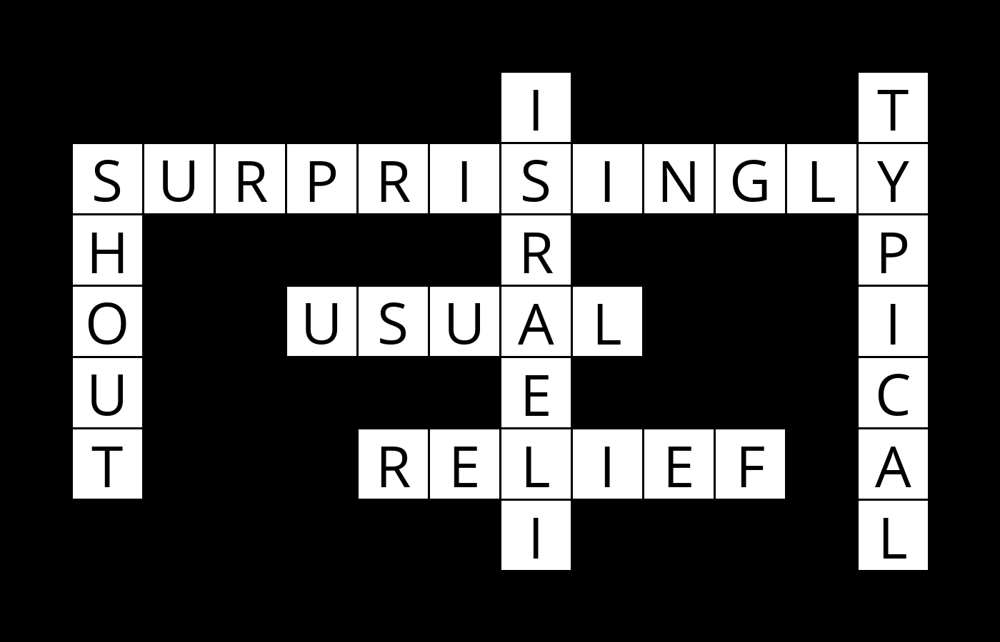

# CrosswordAI

How might you go about generating a crossword puzzle? Given the structure of a crossword puzzle (i.e., which squares of the grid are meant to be filled in with a letter), and a list of words to use, the problem becomes one of choosing which words should go in each vertical or horizontal sequence of squares. We can model this sort of problem as a constraint satisfaction problem. 

This is an AI program that generates crossword puzzles, using a constraint satisfaction problem model with node consistency, arc consistency, and backtracking search.



[View the full assignment description on CS50's OpenCourseWare](https://cs50.harvard.edu/ai/2020/projects/3/crossword/)

## How to Run
1. Requires Python(3) and install Pillow manually or via: ```pip3 install -r requirements.txt``` (for generating image representation of the resulting crossword puzzle)
2. Run : ```python generate.py data/structure1.txt data/words1.txt``` or ```python generate.py data/structure1.txt data/words1.txt output.png```